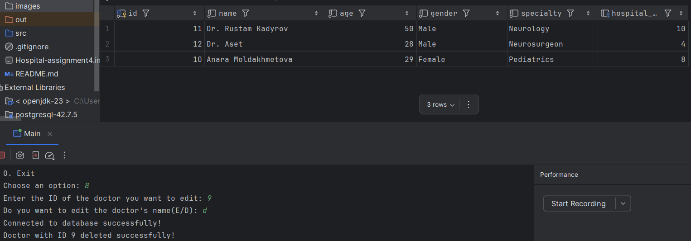

# Hospital Management System

Welcome to the **Hospital Management System**, a Java-based project developed as part of the **Object-Oriented Programming (OOP)** course at **AITU (Astana IT University)**. This system allows users to manage hospitals, doctors, and patients efficiently using object-oriented principles.

---

## Table of Contents

1. [Introduction](#introduction)
2. [Features](#features)
3. [Installation](#installation)
4. [Usage](#usage)
5. [Contact](#contact)

---

## Introduction

The **Hospital Management System** is designed to demonstrate the practical application of Object-Oriented Programming (OOP) concepts such as encapsulation, inheritance, polymorphism, and abstraction. The system provides functionality to add, edit, delete, and sort records for hospitals, doctors, and patients.

This project was developed as part of the **OOP course** at **AITU** to showcase how Java can be used to build real-world applications.

---

## Features

### 1. **View Data**
You can see which data is storage

### 2. **Deleting Data**
You can delete the data by entering to edit data and then choose delete


### 3. **Editing**
You can edit already exist files


### 4. **Sorting Functionality**
You can sort records by various fields such as name, age, or ID in ascending or descending order.


---

## Installation

To set up the project locally, follow these steps:

1. **Clone the Repository**:
   ```bash
   git clone https://github.com/yourusername/hospital-management-system.git
   ```
2.  **Navigate to the Project Directory**:
   ```bash 
   cd hospital-management-system
   ```
3.  **Compile the Project**:
Ensure you have Java installed on your system. Then compile the project using:
bash
   ```bash
   javac Main.java
   ```
4. **Run the Program**:
Execute the program with:
   ```bash
   java Main
   ```
## Usage

Once the program is running, you can interact with the system through the terminal. Here are some example commands:

 * Add a new hospital:
```
1.   Choose an option:
2.   1. Add a new hospital
3.   Enter hospital name: Astana Medical Center
4.   Enter hospital location: Astana
```


 * View all doctors sorted by name:
```
1.   Choose an option:
2.   2. Display sorted doctors
3.   Sort doctors by: name
4.   Order: ASC
```


 * Delete a patient:
```
1.   Choose an option:
2.   3. Delete a patient
3.   Enter the ID of the patient you want to delete: 1
```     

## Contact
   * email: ernazar1902@gmail.com
   * github: https://github.com/achynya 
     

